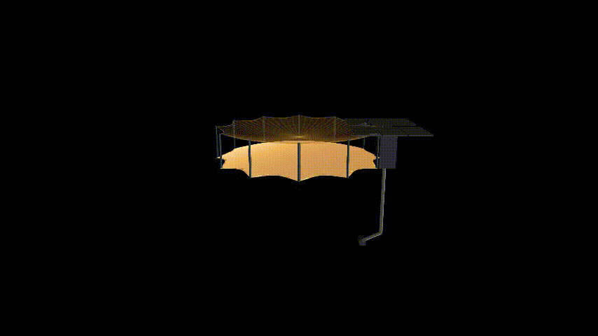

# Off-the-shelf Scenes
This repository contains minimal, ready-to-run manim scenes from the videos.

## 1. How to run a scene:

1. Activate the environment Install uv: curl -LsSf https://astral.sh/uv/install.sh | sh
2. Install dependencies: uv sync
3. Install repository as package uv pip install -e .
4. Activate: source .venv/bin/activate
5. You may also need to install cairo and manim.
6. Run the desired class manim -p -ql scenes/example.py YourSceneName

## 2. Scenes

Synthetic Aperture Radar (SAR) satellite with a mesh reflector antenna.

